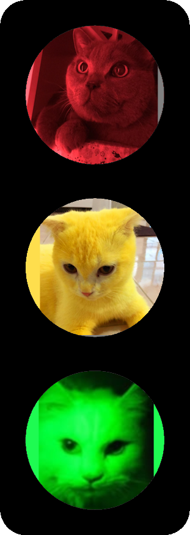
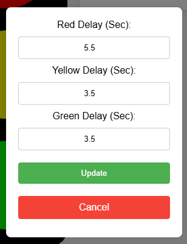
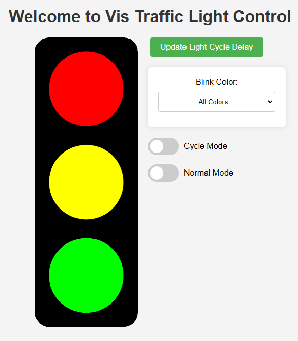

# Traffic Light Signal Controller

<div style="display: flex; align-items: center; flex-wrap: nowrap;">
    <span style="font-size: 20px; max-width: 500px; text-align: justify;">
        This random project is a traffic light controller. The controller mimics the behavior of a standard 
        traffic light system, cycling through red, yellow, and green lights. Use it with LEDs or connect some 
        relays to a real traffic light!
    </span>
</div><br>
<div>
    
    
    
</div>

## Features

- **Realistic timing**: The controller uses realistic timing intervals for each light phase
- **Self hosted WifI AP**: Create it's own WiFi AP or connect to your Wifi
- **Multi client synchronized handling**: Synchronized page events
- **Configurable timing**: You can easily configure the timing duration of each light phase
- ***Cat mode***: Must needed mode, Self explanatory as pictured above
- **State management**: Efficient state management to handle the transitions between different light phases and clients
- **PlatformIO integration**: Built using PlatformIO for easy project management and deployment


## Why did I make this...

Because why tf not, I had nothing better to do and I acquired a broken traffic... and **of course** it needed a awesome wifi controller, and it was fun to build.

## Configuration (ESP32 or other wifi module)

Use [VSCode](https://code.visualstudio.com/) with [PlatformIO](https://platformio.org/install/ide?install=vscode) to compile the and upload the code to your ESP.

You can configure the pinouts light by modifying the `config.h` file:
```cpp
#define LED_red_pin 16
#define LED_yellow_pin 17
#define LED_green_pin 18
```

As well as wifi/AP info
```cpp
bool use_wifi = false; // connect to WiFi or create an access point

// for connecting to a network, use_wifi must be true
const char *ssid = "SSID";
const char *password = "PW";

// or set up an open (or protected) access point
const char *AP_ssid = "Traffic Lights";
// const char *AP_pass = "1234578"; //uncomment me to add a password
```

## Site configuration

To configure the light cycle delay use the **Update Light Cycle Delay menu**:

<div style="display: flex; align-items: center;">
    
</div>

## Site preview

<div style="display: flex; align-items: center;">
    
</div>

